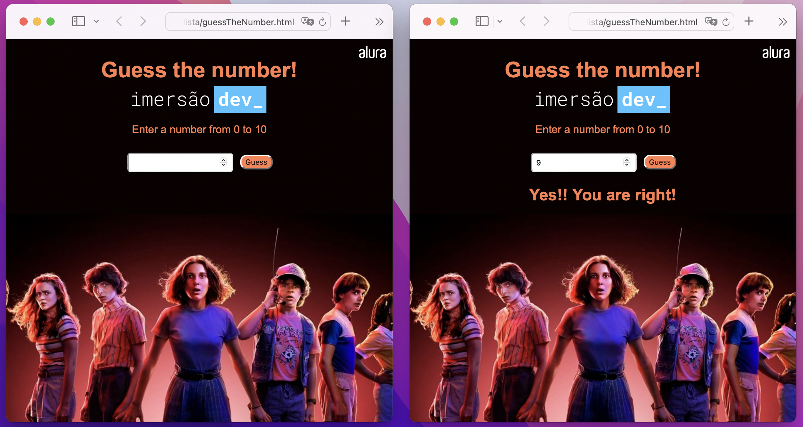

# Mentalista

There is a project similar to this one, made with Swift language, to visualize the click on https://github.com/VanessaTavernari/GuessTheNumber

This project is a game, where the user tries to guess the number that the computer has chosen.

## Project

This project I used HTML to create the website and insert all components, like image, input, and button. There are tags, like html, head, title, body, h1, form, div, and more.

To customise the website, I used CSS which is a style sheet language. In this part was defined font, background, padding, text, color, margin, and more.

JavaScript was used to programming. It gives web pages interactive elements that engage a user. Here, I define variables, functions, conductions, and more.

**Learning about: HTML, CSS, JavaScript, Visual Studio, Website and more.**

##
*This project was developed during the course in Alura school.*
